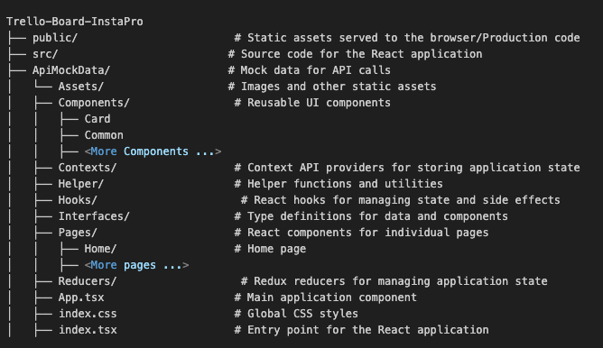

# Task Management Trello Board Project

This project is a Trello board implementation built using React JS and TypeScript. It allows users to use the board with customizable columns and cards, manage tasks, and collaborate efficiently.
It utilizes a system of boards, lists, and cards to represent tasks and their status within a project.

#### Live Demo: [Trello board](https://trello-board-demo.netlify.app)

#### Git link for private repo: [Git Front Link](https://gitfront.io/r/harman6666/PG7U237vShvs/trello-board-instaPro/)

## Folder Architecture

## Screenshots and Video

Video:

https://github.com/harman6666/trello-board-instaPro/assets/16717382/3076e989-4d6b-4923-a5b2-8dc753d22953

## Technologies used 🛠️
- **React JS**
- **TypeScript**
- **React-feather:** For using the icons. React-feather has a collection of simply beautiful open-source icons.
- **React Hooks (useReducer and useContext):** Utilized for state management and context sharing within the application. In a real-world scenario, multiple providers might be employed, and external state management libraries could be integrated for enhanced functionality and scalability.
- **HTML Drag and Drop:** Leveraged for implementing drag-and-drop functionality. Not used any external library.
- **CSS-in-JSS:** Styling solution for writing CSS directly in JavaScript files.

## Components of a Trello Board
1. **Boards**: A board is a top-level container representing a project or a specific task. Each board contains lists and cards related to that project. For now, we have just one board to see the details but more can be added later with some changes in the code.
2. **Lists**: Lists are vertical columns within a board that represent different stages or categories of tasks. For example, lists could represent stages like "To Do", "In Progress", "Testing", and "Done".
3. **Cards**: Cards are individual tasks or items within lists. They can contain information such as task descriptions, due dates, labels, attachments, and comments. Cards can be moved between lists to represent changes in their status or progress.
3. **Card Modal**: A Card Modal is a modal that opens when the user clicks on any available card. The user can perform multiple actions on the modal to update the card as per the need/requirement.

## Features
### Done Items/Features
- **Add and Label Columns:** Users can add columns to the board and label them according to their workflow.
- **Add and Edit Cards:** Users can add new cards to columns and edit existing ones.
- **Move Cards Between Columns (Drag and Drop):** Cards can be easily moved between columns by dragging and dropping.
- **Intuitive Interactions:** User interactions are designed to be intuitive, providing a smooth experience.
- **Local Storage Get/Set:** Board data is stored locally, allowing users to persist their changes across sessions.
- **Open Modal with Details:** Clicking on a card opens a modal displaying detailed information about the task.
- **Add Labels on Cards:** Users can add labels to cards for categorization or prioritization.
- **Add Due Date on Cards:** Due dates can be added to cards to keep track of deadlines.
- **Add Description:** Each card can have a description added to provide additional context or instructions.

### In-Progress
- **Drag-Drop Whole List:** Currently working on enabling drag-and-drop functionality for the entire list of cards.
- **Accessibility:** Accessibility is important and should be implemented across the application. Currently, I use all the semantic tags but we can do more like aria-roles, titles, roles, etc.

### To-Do
- **Create Multi-board Page:** Implement a page where users can manage multiple boards.
- **Change Background Color/Image:** Allow users to customize the background of their boards with colors or images.
- **Create Constant Files:** Extract constants into separate files for better maintainability.
- **Unit Testing:** Unit testing is very important in terms of the maintainability of the code.

## Getting Started
To run the project locally, follow these steps:
1. Clone the repository to your local machine.
2. Navigate to the project directory.
3. Install dependencies using `yarn install`.
4. Start the development server using `yarn run start`.
5. Open your browser and navigate to `http://localhost:3000` to view the application.

